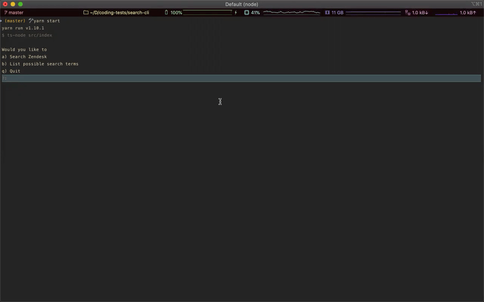
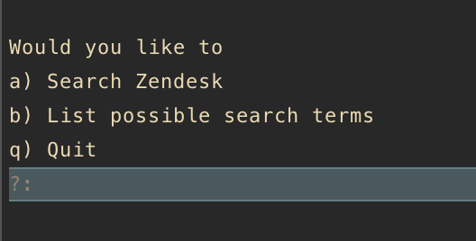
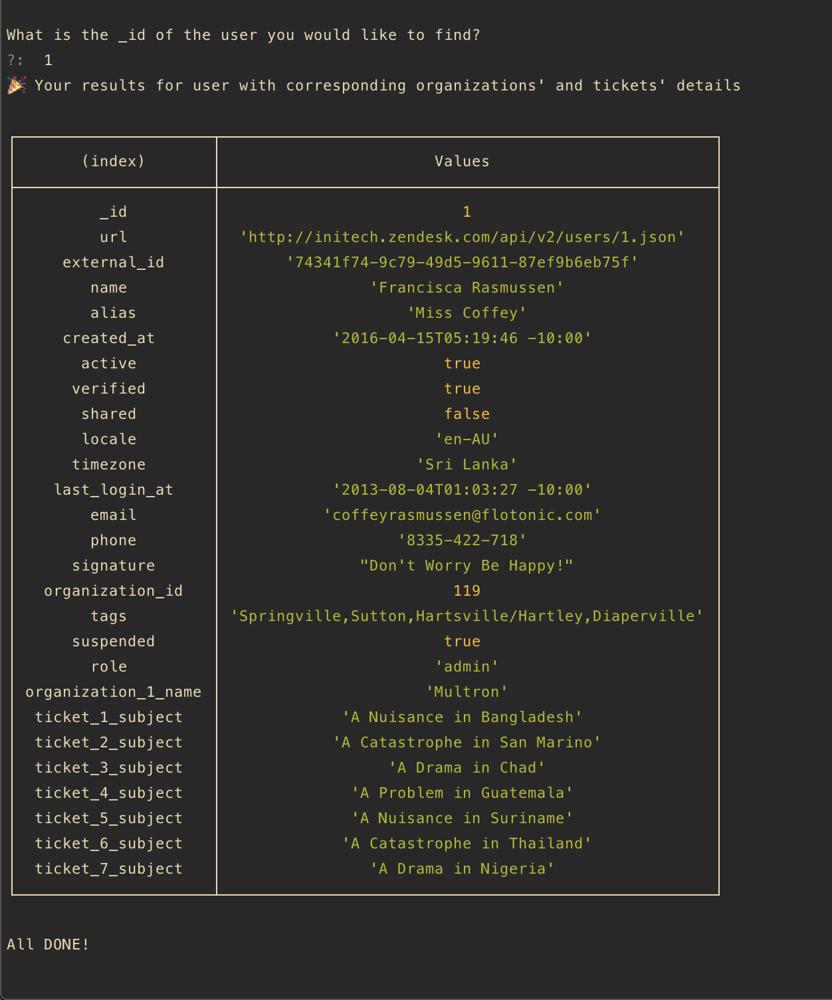

# Search CLI Application 

CLI Search Application which demonstrates a use of lookup method to find desired items. 

## Tools

-   TypeScript

    Typescript language support
    -   config file: `tsconfig.json`
    -   dependencies: typescript
    -   optional dependencies: @types/node, ts-node

-   Jest

    Testing framework with typings
    -   config file: `jest.config.js`
    -   dependencies: jest, ts-jest, @types/jest

-   ESLint

    Linting tool with TS support
    -   config file: `.eslintrc.js`
    -   dependencies: eslint, @typescript-eslint/parser, @typescript-eslint/eslint-plugin

-   Node v12

## Usage

```
    $ yarn install # to install dependencies
    $ yarn start   # to run project locally
    $ yarn build   # to build the project
    $ yarn lint    # run linter
    $ yarn test    # run test 
```
In order to run this project locally run `yarn install` first , and follow with `yarn start`

## Tests 
 
Application has been tested with the use of Jest test runner. You can run `yarn test:watch` if you would like tests to keep watching for changes while you work/

## Structure

```
├── data                            # data sets for organizations tickets and users
│   ├── organizations.json
│   ├── tickets.json
│   └── users.json
├── src 
│   ├── cli             
│   │   ├── index.ts                # cli promisified renderings 
│   │   ├── mainMenuHandler.ts      # entry point handler
│   │   └── searchZendesk.ts        # the core search results handler
│   ├── search
│   │   ├── generateMap.test.ts     
│   │   ├── generateMap.ts          # map generator
│   │   ├── index.test.ts       
│   │   ├── index.ts                
│   │   ├── lookupSearch.test.ts
│   │   ├── lookupSearch.ts         # lookup search
│   │   ├── utils.test.ts
│   │   └── utils.ts                # utilities 
│   ├── types                       # typings
│   │   ├── InitialOption.ts
│   │   ├── Organization.ts
│   │   ├── Search.ts
│   │   ├── Ticket.ts
│   │   ├── User.ts
│   │   ├── index.ts
│   │   └── interactive-cli.d.ts    # silence TypeScript in relation to non types third party library
│   └── index.ts                    # entry file which initializes map and custom CLI tool
├── README.md
├── jest.config.js                  # jest test runner configuration
├── package.json    
├── tsconfig.json                   # TypeScript configuration
└── yarn.lock
```

### Search considerations

- The problem of fast searching for data has been solved with a lookup. In order to be able to do that there is a need of remapping existing data to a different structure that would represent a map of every field and their values being related to the actual searchable item (User, Ticket or Organization)

- This is possible only if we can store the map in memory. The user experience will be better since we can retrieve results faster, however the boot up time can be compromised by this solution depending on the original data set. 

### Assumptions

> The main assumption here is that we have enough memory to map the given data and store in the memory. This will perform better than ordinary linear search even if we consider some of the sorted properties by search in a binary search. 

> The search also assumes types of values `string` or `Array` . 

> The cli present only a handful of properties from related items. For example if user has searched for an Organization, the results will show all details of organizations, however it will show only related ticket's `subject` and only related user's `email` and `organization_name`

### Application flow

1. Boot up - generate the map for provided data and organize the map by corresponding keys of `users` `organizations` and `tickets`
2. Welcome the user with the `mainMenuHandler` which gives 3 options
   - Search
   - List possible search fields
   - Quit

3. Search will kick off search flow 

    - request search type (`users`, `organizations`, `types`)
    - request search field (present to user possible choices based on previous selection)
    - request for the final value of the search

        - If results are found user will be presented with relevant table which will include details of the primary search item, and values from corresponding other type items
        - If results are not found user is notified about lack of results
        - If user has request wrong type or field, the error message will be tailored hinting that a particular type or field does not exist 
        - 
4. Listing fields will output all possible search fields group by search type. 
    - basic listing which returns the user to `mainMenuHandler`

### Trade offs

The main trade off with mapping the data up front and storing it in the memory are potential issues with scalability when the data reaches particular size. 

This approach also works `only` with the exact matches of the user's input. Any type of fuzzy searches will not work with this lookup.

### Final notes

This submission assumes that the main goal is to spark a conversation about different ways of searching through data. Searching gets complex quite quick and this is just an example implementation of the lookup using selected tools. 

While the core map generation and search functionality are tested to cover some edges cases and general functionality, the CLI rendering methods are not tested as they would have to be in PRODUCTION. The focus has been put primarily on the search problem.

### Screenshots 



∂




